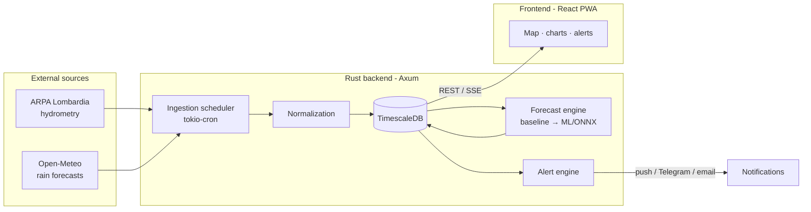

# Argine — River Level Monitoring & Forecasting

> Initial ideas and design document. A living starting point: add, fix, or cut freely.

## 1. Vision

A system that monitors river levels in (near) real time and produces **short-term forecasts** (next 6–24 h) based on meteorological models, with **alerts** when risk thresholds are exceeded.

**First target river: the Seveso** (Brianza/Como basin → Milan).

### Why the Seveso is a good use case
- It is known for recurrent flooding in Milan (Niguarda / Isola / Pratocentenaro areas).
- There is a **lag** of several hours between rainfall in the upstream basin and the peak level in the city: this very window is what makes a forecast *useful and actionable*.
- Hydrometric data is public (ARPA Lombardia).

## 2. Domain context

- The downstream river level is a function of: rainfall upstream, soil saturation state, current level, and detention infrastructure (Senago/Lentate retention basins, North-West spillway channel).
- **Alert thresholds** (yellow / orange / red) are defined by Civil Protection for each hydrometric station. The system must map the forecast level onto these thresholds.
- The realistic forecast for the MVP is of the **rainfall → river level** type, with a horizon of a few hours (matching the basin's concentration time).

## 3. Data sources

### River level (observed)
- **ARPA Lombardia** — hydrometric stations, level (m) and flow rate.
  - Open data via Socrata portal: `dati.lombardia.it` (REST/JSON API).
  - Check update frequency (typically 10–60 min) and identify the stations on the Seveso.
- Possible fallback / integration: AIPO, Civil Protection Lombardia.

### Weather (forecast + observed)
- **Open-Meteo** (recommended for MVP): free, no API key, hourly forecast precipitation from ICON / ECMWF / GFS models. Queryable by basin coordinates.
- ARPA Lombardia: observed rain-gauge data (useful for validation and as model features).
- (Future) ECMWF / DWD ICON-D2 directly for more control over the models.

### Geodata
- Boundaries of the Seveso **hydrographic basin** (to aggregate rainfall over the right area).
- Location of hydrometric and rain-gauge stations.
- **DTM / LIDAR** of the river area (for spatial flood mapping, see §6-bis).

## 4. Architecture (high level)



The backend's three key responsibilities:
1. **Ingestion**: periodic jobs that fetch hydrometry + weather forecasts and store them as time series.
2. **Forecasting**: from forecast rainfall + current state, estimate the future level.
3. **Alerting**: compare forecast/observed level against thresholds and notify.

## 5. Technology stack

### Backend — Rust (as requested)
- **Web framework**: [Axum](https://github.com/tokio-rs/axum) — modern, ergonomic, great Tokio ecosystem.
- **Async runtime**: Tokio.
- **HTTP client** (fetch external APIs): `reqwest`.
- **DB**: PostgreSQL + **TimescaleDB** (time-series extension) via `sqlx` (async, compile-time checked queries).
- **Scheduler**: `tokio-cron-scheduler` for ingestion jobs.
- **Serialization**: `serde` / `serde_json`.
- **Config**: `figment` or `config` + environment variables.
- **Observability**: `tracing` + `tracing-subscriber`.

### Frontend — React + TypeScript
- **Build**: Vite.
- **Data fetching**: TanStack Query.
- **Time-series charts**: **uPlot** (very fast for time series) or Recharts (simpler, less performant).
- **Map**: MapLibre GL or Leaflet (stations + basin).
- **Styling**: Tailwind CSS.
- **PWA**: consider from the start (see §10) for mobile alert notifications.

> FE alternatives to evaluate: **SvelteKit** (lighter, great DX) if there is no React constraint. For an app that is mostly "dashboard + alerts" both work fine; React remains the safe choice for ecosystem and future assumptions.

### Machine Learning (for the "real" forecast)
**Decision made: training in Python, serving via ONNX inside Rust.** No Python dependency at runtime, faster inference, deploy in a single binary/image.
- **Training in Python** (scikit-learn / XGBoost / LightGBM) on historical data → export the model to **ONNX**.
- **Serving**: inference inside the Rust backend with `ort` (ONNX Runtime, mature bindings) or `tract` (pure Rust, great for small models).
- Model versioning: versioned `.onnx` file + `model_version` column in stored forecasts.
- For the MVP, the **statistical baseline** is implemented directly in Rust (see §6, Phase 1) without ML — ML arrives in Phase 2 keeping the same forecast interface.

## 6. Forecast model (phased)

### Phase 1 — Baseline (no ML)
- Empirical model: regression with a **lag** between cumulative rainfall in the basin and the level.
- Example: `level(t+h) ≈ level(t) + α · forecast_cumulative_rain(t..t+h) − β · drainage`.
- Calibrate α, β on historical data. Simple, interpretable, already useful.

### Phase 2 — Data-driven / ML
- Features: current level and trend, recent observed rainfall (e.g. last 6–24 h), *forecast* rainfall (Open-Meteo), seasonality, possibly soil saturation.
- Target: level at +1h, +3h, +6h, … (multi-horizon).
- Models: gradient boosting (XGBoost/LightGBM) as first choice; later evaluate recurrent / temporal models if the data justifies it.

### Phase 3 — Hydrological (advanced, optional)
- Physically-based rainfall-runoff model (HEC-HMS style) with the real basin. More expensive, to consider only if quality requires it.

**Validation**: backtesting on historical flood events, metrics such as RMSE/MAE on the level and, above all, **accuracy in predicting threshold exceedance** (precision/recall on alerts).

## 6-bis. Spatial forecasting — risk zone mapping

Goal: from the (point) forecast level at the station, derive **where** flooding occurs over the territory, drawing risk zones on the map that update with the weather forecast.

### Approach: HAND (Height Above Nearest Drainage)
Standard, lightweight method, well-suited to dynamic forecasting:
1. **DTM acquisition** at high resolution (1–2 m LIDAR along the Seveso from Geoportale Lombardia / national geoportal).
2. **Offline pre-computation (one-off)** of the **HAND** raster = height of each cell relative to the nearest drainage channel. Requires: DEM hydro-conditioning, flow direction/accumulation, stream network extraction.
3. **At runtime**: given the forecast level `L`, cells with `HAND < L` (relative to the channel elevation) are potentially flooded → raster thresholding, a **very fast operation**.
4. **Pre-computation of discrete levels** (e.g. every 10 cm) → ready flood-extent polygons, served as **vector tiles** and selected based on the current forecast.

### Official reference layers (static)
Overlay the official hydraulic hazard maps, to use as context/validation:
- **PGRA** (Flood Risk Management Plan) and **PAI** — ISPRA / Po River District Basin Authority.
- Scenarios by return period (frequent / medium ~100–200 years / rare ~500 years).
- Available via **WMS/WFS** and shapefile → directly integrable into MapLibre.

Map result: **static official zones** (hazard context) + **dynamic zone predicted by us** (changes with the weather forecast, with a temporal indicator "+3h / +6h").

### Geospatial stack
**Decision made: offline HAND preprocessing in Python (pragmatic).** Since HAND computation is a **one-off offline batch**, runtime performance is irrelevant there, so we use the most mature/convenient tooling — Python's geo ecosystem. (Note: WhiteboxTools is Rust-native but also ships Python bindings, so even using it we can drive it from Python.)
- **Offline preprocessing (Python)**: GDAL / `rasterio` / `pysheds` or **WhiteboxTools** for DEM conditioning, flow direction/accumulation, stream extraction and HAND. Pure batch pipeline, not at runtime.
- **Serving (Rust)**: `geo`, `geojson`, optional `gdal` binding; generation/serving of vector tiles (e.g. MVT) or pre-computed GeoJSON. The heavy part is pre-computed, so the backend only serves lookups + tiles. The runtime `HAND < level` lookup is trivial in Rust.
- **Frontend**: **MapLibre GL** with raster/vector layers, a time slider over the forecast, and toggles for the official PGRA/PAI layers.

> Principle: the live serving path stays in Rust; the offline geo batch uses whatever tool is most convenient (Python here). No need to force Rust on a one-off preprocessing job.

> Realism note: HAND is a "static" approximation of the extent (it does not simulate hydraulic dynamics like a 2D model such as HEC-RAS). It is an excellent speed/usefulness compromise for alerting; a 2D hydraulic model remains an advanced-phase option if higher fidelity is needed.

## 7. Data schema (draft)

```sql
-- measurement stations
station(id, name, river, kind /* hydrometric|rain */, lat, lon, source, external_id)

-- alert thresholds per station
threshold(station_id, level /* yellow|orange|red */, value_m)

-- observations (time series, TimescaleDB hypertable)
observation(station_id, ts, metric /* level_m|rain_mm */, value)

-- weather forecasts (time series)
weather_forecast(basin_id, ts, run_ts, rain_mm, model)

-- level forecasts produced by us
level_forecast(station_id, ts, run_ts, value_m, horizon_h, model_version)

-- emitted alerts
alert(id, station_id, level, created_at, forecast_value, message, status)
```

## 8. API (REST draft)

```
GET  /stations                      → list of stations
GET  /stations/{id}                 → detail + thresholds
GET  /stations/{id}/observations    → level history (?from&to)
GET  /stations/{id}/forecast        → current level forecast
GET  /alerts                        → active/recent alerts
GET  /stream/alerts (SSE)           → real-time alert push
```

## 9. Alerting

- Continuous computation: comparison between `level_forecast` and `threshold` per station.
- Levels: **yellow / orange / red** (mapped to Civil Protection thresholds).
- Notification channels (incremental):
  1. In-app + Server-Sent Events.
  2. **Telegram bot** (simple, free, great for the MVP).
  3. Web Push (PWA).
  4. Email.
- Anti-spam: debounce / hysteresis to avoid re-notifying on every tick.

## 10. PWA & mobile

The real value of such a system is receiving the alert *before* the event. Making the frontend a **PWA** enables Web Push notifications without developing a native app. Recommended as an MVP+1 goal.

## 10-bis. Deploy — Docker

**Decision made: everything containerized, deploy via Docker images.**

Services (orchestrated with **Docker Compose** for dev and on the VPS):
- `argine-backend` — Rust backend (Axum). Multi-stage build (compile in `rust` image, runtime on `debian-slim` or `distroless` for a lightweight image). Includes the `.onnx` model.
- `argine-frontend` — React static build served by Nginx (or served directly by the backend as static assets, TBD).
- `db` — PostgreSQL + **TimescaleDB** (`timescale/timescaledb` image).
- `geo-preprocess` — **Python** batch image (GDAL / pysheds / WhiteboxTools) for HAND computation. Run on-demand/batch, not always running.
- (optional) `tiles` — vector tile server, if not served by the backend.

Notes:
- Versioned DB migrations (`sqlx migrate`).
- Config via environment variables / `.env` (no secrets in the images).
- Persistent volumes for the DB and for pre-computed rasters/tiles.
- Reverse proxy / TLS in front (Caddy or Traefik) for production deploy.

## 10-ter. Security (by design)

Security is baked in from day one rather than retrofitted. Full details, with the Rust
crate mapping and a baseline checklist, live in [`SECURITY.md`](./SECURITY.md). In short:

- **Auth**: JWT (HS256, `jsonwebtoken`), `exp` always validated, short-lived admin tokens.
- **Passwords**: Argon2id hashing (`argon2`), never plaintext.
- **Secrets**: all via env; **fail-fast at startup** if any secret is still `changethis`
  in non-local environments. Only `.env.example` committed.
- **CORS**: explicit origin allowlist (no `Any` in prod) via `tower-http`.
- **Transport**: TLS at Caddy/Traefik + HSTS + security headers; HTTP→HTTPS redirect.
- **Input/SQL**: `sqlx` parameterized queries only; `serde` + `validator` on all inputs.
- **Containers**: non-root, distroless/slim, no secrets in images, DB on internal network only.
- **Public/private asymmetry**: read endpoints (levels, forecasts, maps) stay public;
  auth gates only admin, writes, and subscriber data.

Practices adapted from the
[Full-Stack FastAPI Template](https://github.com/fastapi/full-stack-fastapi-template),
translated to our Rust/React/Docker stack.

## 11. Roadmap (MVP first)

**MVP (week 1–2)**
- [ ] Minimal Axum backend + Postgres/TimescaleDB.
- [ ] Seveso hydrometry ingestion from ARPA (1 station).
- [ ] Rain forecast ingestion from Open-Meteo for the basin.
- [ ] `/stations/{id}/observations` endpoint.
- [ ] React FE: 1 level chart + latest rain forecasts.
- [ ] Security baseline: `.env.example` + startup fail-fast on default secrets + CORS allowlist + TLS proxy (see `SECURITY.md`).

**Phase 1 — baseline forecast**
- [ ] Lag-based empirical model in Rust.
- [ ] `/forecast` endpoint.
- [ ] Thresholds + alert engine + Telegram notification.
- [ ] Admin auth: JWT (`jsonwebtoken`) + Argon2 passwords + role-gated write endpoints (see `SECURITY.md`).

**Phase 2 — ML + UX**
- [ ] Python training pipeline + ONNX export + serving in Rust (`ort`/`tract`).
- [ ] Stations map, PWA + Web Push.
- [ ] Backtesting on historical events.

**Phase 3 — spatial forecasting**
- [ ] DTM/LIDAR acquisition for the Seveso.
- [ ] Offline HAND computation pipeline (Python: GDAL / pysheds / WhiteboxTools) → polygons per level.
- [ ] Dynamic risk-zone layer on MapLibre + time slider.
- [ ] Integration of official PGRA/PAI layers (WMS/WFS).

**Phase 4 — scalability**
- [ ] Generalize to more rivers/stations.
- [ ] 2D hydraulic model (optional, if higher spatial fidelity is needed).

## 12. Open questions / to decide

1. **Data history**: how many years of ARPA data are available and downloadable? (Determines ML feasibility in Phase 2.)
2. **Seveso station(s)**: which hydrometric station to use for the MVP? (e.g. Milan via Valfurva / Niguarda.)
3. **Basin**: is the real basin boundary needed, or is an approximate area (bounding box / set of points) enough to aggregate rainfall?
4. **DTM/LIDAR**: resolution and coverage available for the Seveso from Geoportale Lombardia? (Determines spatial forecast quality.)
5. **Frontend hosting**: React build served by a separate Nginx, or as static assets from the Rust backend?
6. **Data licensing / usage** for ARPA, Open-Meteo, PGRA/PAI, DTM: verify terms for use and redistribution.

### Decisions already made
- **ML**: training in Python → **ONNX serving inside Rust** (`ort`/`tract`), no Python dependency at runtime.
- **Deploy**: **all Docker**, orchestrated with Docker Compose.
- **Spatial forecasting**: confirmed as a goal (Phase 3) — **HAND** approach from DTM + official PGRA/PAI layers.
- **Geo preprocessing**: offline HAND batch in **Python** (GDAL / pysheds / WhiteboxTools) — pragmatic, since it's a one-off job; live serving stays in Rust.

---

### Suggested next step
Validate the **data sources** before writing code: a small exploration of the ARPA Lombardia APIs (find the Seveso station(s) and the data format) and a test call to Open-Meteo for the basin. From there the data schema takes shape and the MVP can start.
