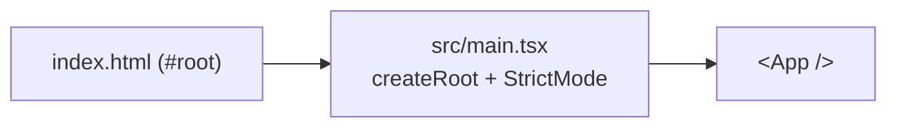

# Frontend architecture

React + TypeScript single-page app built with **Vite**, managed with **pnpm**. This document
tracks the _implemented_ structure; planned pieces are marked as such.

## Tooling

- **Build:** Vite 8 (`vite.config.ts`, `@vitejs/plugin-react`).
- **Language:** TypeScript 6, strict mode (`tsconfig.json`).
- **Package manager:** **pnpm** — install scripts blocked by default; allowlist in
  `pnpm-workspace.yaml` (`onlyBuiltDependencies: [esbuild]`). Lockfile `pnpm-lock.yaml` committed.
- **Scripts:** `dev` (vite), `build` (`tsc --noEmit && vite build`), `preview`,
  `lint` (ESLint), `format`/`format:check` (Prettier), `test`/`test:coverage` (Vitest),
  `test:e2e` (Playwright).
- **Lint/format:** ESLint (flat config, `typescript-eslint`, react-hooks, jsx-a11y) +
  Prettier; both enforced by pre-commit and CI.

## Testing

- **Unit/component:** **Vitest** + Testing Library (jsdom). Setup in `src/test/setup.ts`
  (jest-dom matchers + per-test cleanup + MSW server lifecycle). Coverage via v8.
- **API mocking:** **MSW** (`src/test/server.ts`, `handlers.ts`) intercepts backend calls in
  node — no real API in tests. E2E mocks at the network layer via Playwright `page.route`.
- **E2E:** **Playwright**, critical journeys only, under `e2e/` (`playwright.config.ts`
  builds + previews the app). Examples: `e2e/app.spec.ts`, `e2e/chart.spec.ts`.
- Run: `pnpm test` / `pnpm test:e2e` (or `make test-frontend` / `make e2e`).

## Entry flow

## Structure (current)

| File                          | Responsibility                                          |
| ----------------------------- | ------------------------------------------------------- |
| `index.html`                  | HTML host, mounts `#root`, loads `src/main.tsx`         |
| `src/main.tsx`                | React root, `StrictMode`, `QueryClientProvider`         |
| `src/App.tsx`                 | station selector + level view                           |
| `src/lib/api.ts`              | typed client for the backend read API (`VITE_API_URL`)  |
| `src/hooks/queries.ts`        | TanStack Query hooks (`useStations`, `useObservations`) |
| `src/components/LevelChart.tsx`  | uPlot time-series wrapper                            |
| `src/components/StationLevel.tsx`| loads + renders one station's series (states)       |
| `src/test/*`                  | MSW server/handlers + render helper                     |
| `src/vite-env.d.ts`           | Vite client type refs                                   |

## Data layer

**TanStack Query** wraps a small typed client (`src/lib/api.ts`) over the backend read API.
Base URL from `VITE_API_URL` (defaults to `http://localhost:8080`). The backend's
`CORS_ORIGINS` must include the frontend origin (`http://localhost:5173` for dev). See
[`features/level-chart.md`](./features/level-chart.md).

## Planned components (not yet implemented)

Tracked in [`IDEAS.md`](../../IDEAS.md); each gets a `features/` doc when built:

- Map: **MapLibre GL** (stations + dynamic risk zones + PGRA/PAI layers).
- Forecast overlay on the level chart; alerts view.
- **PWA** + Web Push for alerts.
- Routing, styling (**Tailwind**).
